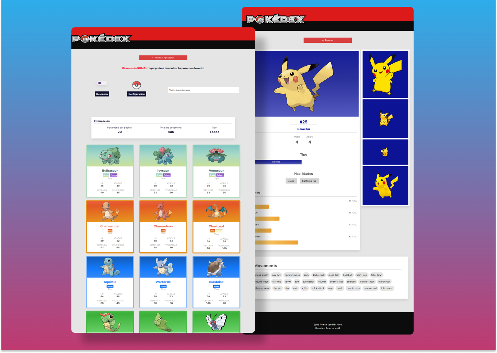

# PokemonApp &mdash; React 😼



This responsive web application performs consumption to different endpoints of a well-known API, with which multiple characters of the Pokemon series are deployed.

It has the possibility of filtering the characters by means of certain criteria that the user can choose, as well as making searches through the name of some of these same.

In addition, it has integrated an alert system that prevents unexpected entries, dynamic paging, loading screen, and a path in which the user can make configurations such as the theme and the number of characters per page.

It is worth mentioning that this project uses different routes to control navigation within the application and implements protected routes.

PokemonApp was developed with Vite App.

The API used in this project is: 

```
https://pokeapi.co/
```

You can check its functionality in: 

```
https://pokemonsrsn.netlify.app
```

## ***Techonologies and tools used:***

 * ReactJS
 * Redux
 * React Router DOM
 * Javascript
 * CSS3
 * Fetch API
 * Local Storage
 * Netlify
 * Vite

Node was used to carry out this project, so, you must have in your system this language. Specifically version **16.16.0**.

Once you check this previous specification, you must install development dependencies. To do this, just execute into your terminal:

```
npm install
```

To see the changes that you apply in the code, you must run the application. Type the command:

```
npm run dev
```

## ***UI Considerations***

Colors used
 
 * Color Theme Light: #E5E5E5
 * Color-theme-dark: #111B21;
 * Color-red-1: #DD1A1A;
 * Color-red-2: #D93F3F;
 * Color-red-3: #FE1936;
 * Color-red-4: #ED8F8F;

 * Color-font-1: #302F2F;
 * Color-font-2: #0F0F2D;
 * Color-font-3: #4F4F4F;
 * Color-font-4: #9F9F9F;
 * Color-font-5: #212121;

 * Color-black-1: #000000;
 * Color-black-2: #0C0C0C;

 * Color-white: #FFFFFF;
 * Color-window-dark: #222E35;

 * Color-alert-1: #5B3184  

Breaking Points: 

 * Tablets: 768px
 * Landscape Tablets: 992px
 * Laptops: 1200px
 * Desktops: 1400px